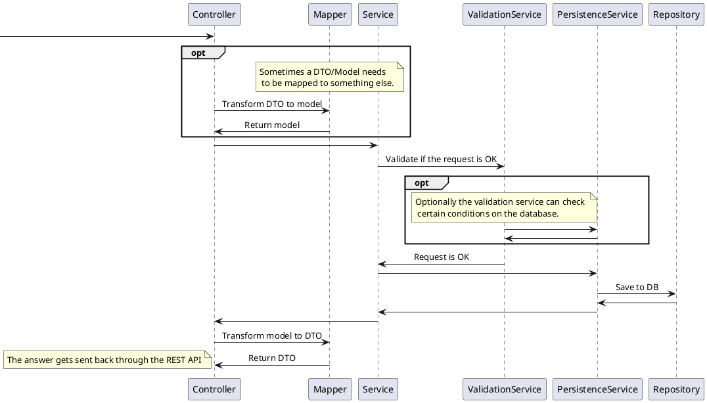

# Backend Overview

The backend is structured into the following levels:
- `XYZController`: receives requests through the API for endpoint /xyz
- `Mapper`: maps from/to DTOs
- `XYZService`: the business service for XYZ
- `ValidationService`: validates business constraints
- `PersistenceService`: provides access to the database and any operations that need the database
- `Repository`: interface to the database

A hypothetical request is plotted in the diagram below. Note that some calls are optional.
