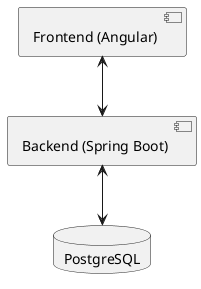

# Overview

The application is a classic webapp, which means it has 3 parts:
- a frontend written in [Angular](https://angular.dev/)
- a backend written in [Spring Boot](https://spring.io/projects/spring-boot)
- a [PostgreSQL Database](https://www.postgresql.org/)

